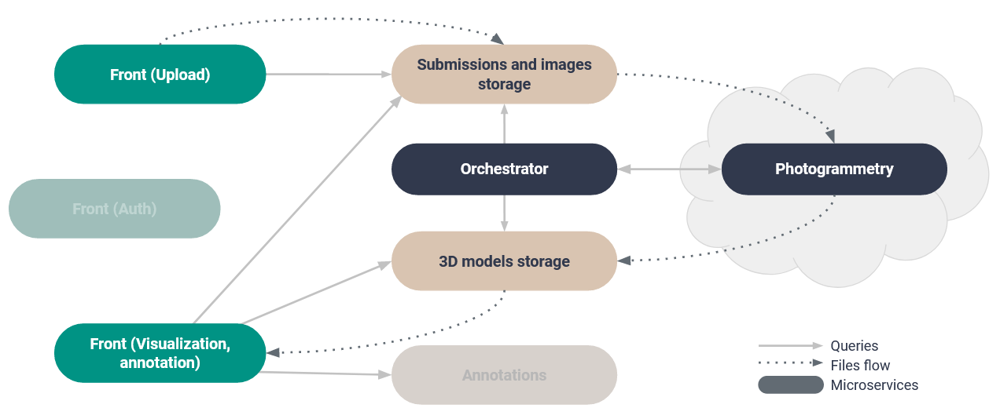
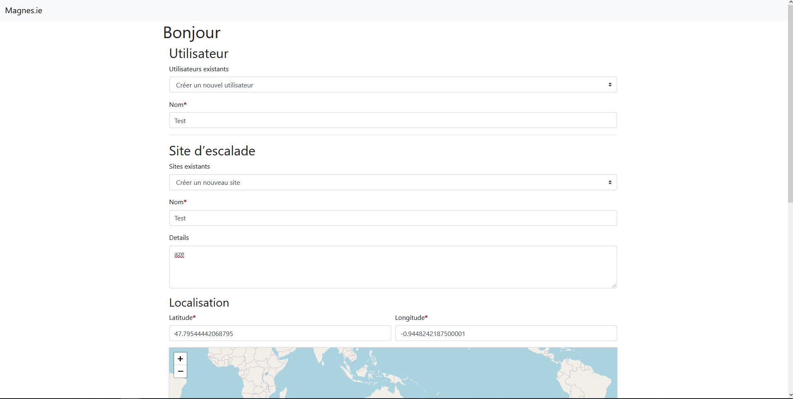
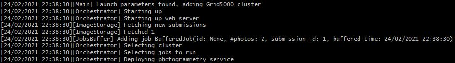
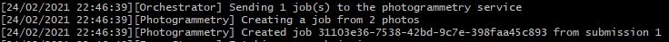
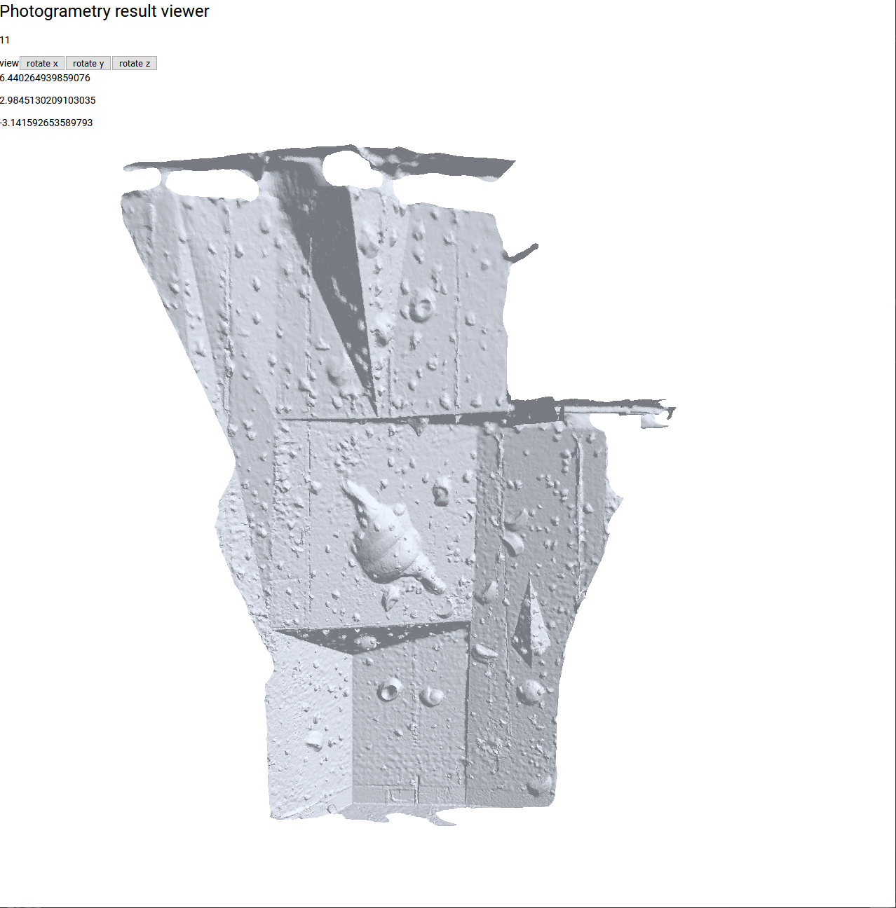

# Magnesie

## Project presentation

This project's goal is to use micro-services to generate 3D-models of climbing walls and make them available on a website. The idea is to only deploy and run the photogrammetry service to generate the models when the cluster on which it will be deployed has available green energy.

## Project architecture

The project is composed of multiple micro-services as shown in the following architecture diagram :

You can also see the [detailed architecture](docs/img/architecture_diagram.JPG).

The users acces the application from the [front service](https://github.com/magnesie/magnesie-image-storage-webapp) that allows them to request a generation of a 3D model by uploading photos of climbing walls to a [database](https://github.com/magnesie/magnesie-image-storage).

The heart of the application is the [orchestrator](https://github.com/magnesie/magnes-ie-orchestrateur). This service can see when a generation request has been made, and add these requests to a buffer. Every 10 minutes, the orchestrator checks if any of the cloud providers it knows has available green energy. If so, it deploys a [photogrammetry service](https://github.com/magnesie/magnesie-photogrammetry) on this cloud provider's infrastructure if none are already deployed, and orders it to generate a 3D model using the photos of the request.

When the photogrammetry service is done, it notifies the orchestrator, which contacts the [3D models database](https://github.com/magnesie/magnesie-result-storage) to make it download the newly generated model, so that users can visuzalize it with the [result front service](https://github.com/magnesie/magnesie-result-front).

## Deployment

At the time of writing, to deploy the project, you must deploy each micro-services on the same machine (except for the photogrammetry service which will be deployed by the orchestrator, potentially on a distant node). The deployment instructions for each services are specified in their respective repository.

## Use case

Once each service has been deployed, you can acces the image uplaod front endpoint to create a new model generation submission by filling in the required information and uploading at least 2 photos.

The orchestrator checks every 10 minutes if new submissions have been made, and sends those submission to the photogrammetry service, deploying it if needed.

Once the photogrammetry service has finished, it will return the download link for the 3D model, which the orchestrator will send to the result database. The result front will then be usable to view this 3D-model.

