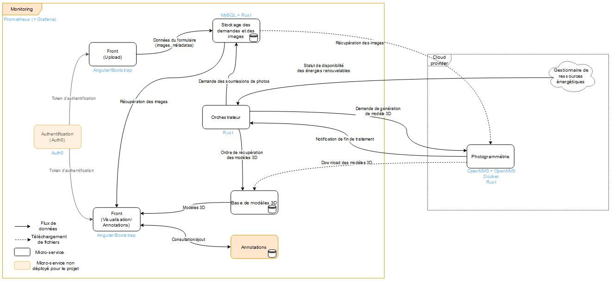

# Magnesie

## Project presentation

This project's goal is to use micro-services to generate 3D-models of climbing walls and make them available on a website. The idea is to only deploy and run the photogrammetry service to generate the models when the cluster on which it will be deployed has available green energy.

## Project architecture

The project is composed of multiple micro-services as shown in the following architecture diagram :

The users acces the application from the [front service](https://github.com/magnesie/magnesie-image-storage-webapp) that allows them to request a generation of a 3D model by uploading photos of climbing walls to a [database](https://github.com/magnesie/magnesie-image-storage).

The heart of the application is the [orchestrator](https://github.com/magnesie/magnes-ie-orchestrateur). This service can see when a generation request has been made, and add these requests to a buffer. Every 10 minutes, the orchestrator checks if any of the cloud providers it knows has available green energy. If so, it deploys a [photogrammetry service](https://github.com/magnesie/magnesie-photogrammetry) on this cloud provider's infrastructure if none are already deployed, and orders it to generate a 3D model using the photos of the request.

When the photogrammetry service is done, it notifies the orchestrator, which contacts the [3D models database](https://github.com/magnesie/magnesie-result-storage) to make it download the newly generated model, so that users can visuzalize it with the [result front service](https://github.com/magnesie/magnesie-result-front).

